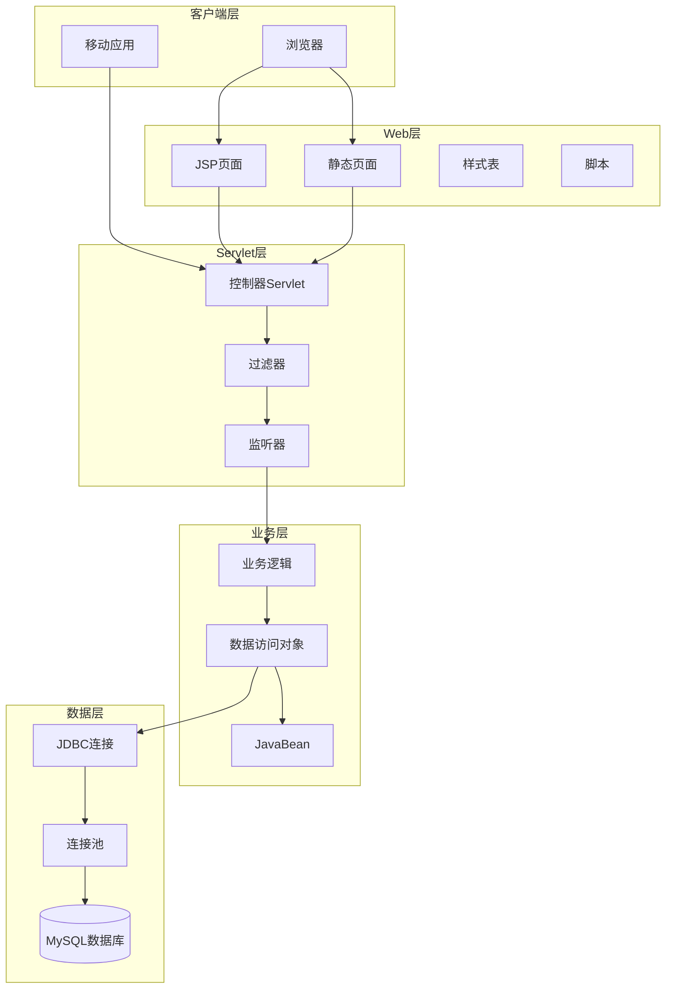

# 🌐 st-javaWeb - Java Web开发学习项目


## 📖 项目简介

st-javaWeb是Java Web开发技术的系统性学习项目,涵盖Servlet、JSP、JDBC、Filter、Listener等核心技术,从基础到进阶,循序渐进掌握Java Web开发。

## 🏗️ 系统架构



## 📚 学习路径

### 第一阶段: 基础入门

- **Servlet基础**: Servlet生命周期、配置、请求响应
- **JSP基础**: JSP语法、指令、动作标签
- **JDBC基础**: 数据库连接、CRUD操作

### 第二阶段: 核心技术

- **会话管理**: Cookie、Session、Application
- **过滤器**: 请求过滤、编码转换、权限验证
- **监听器**: 事件监听、应用初始化

### 第三阶段: 进阶应用

- **MVC模式**: 模型-视图-控制器架构
- **文件上传**: 文件上传下载处理
- **AJAX**: 异步请求处理
- **分页查询**: 数据分页显示

## 🚀 快速开始

### 环境要求

- JDK 8+
- Tomcat 9+
- MySQL 5.7+
- Maven 3.6+

### 安装步骤

```bash
# 1. 克隆项目
git clone https://github.com/yourusername/st-javaWeb.git

# 2. 导入IDE
# 使用IntelliJ IDEA或Eclipse导入Maven项目

# 3. 配置数据库
# 执行 db/init.sql 创建数据库和表

# 4. 修改配置
# 修改 src/main/resources/db.properties
db.driver=com.mysql.cj.jdbc.Driver
db.url=jdbc:mysql://localhost:3306/study_java_web
db.username=root
db.password=your_password

# 5. 部署运行
# 配置Tomcat服务器并部署项目
```

## 🛠️ 技术栈

| 技术 | 版本 | 说明 |
|------|------|------|
| Servlet | 4.0 | Web应用核心 |
| JSP | 2.3 | 动态页面技术 |
| JDBC | - | 数据库连接 |
| MySQL | 5.7+ | 关系数据库 |
| Tomcat | 9+ | Web服务器 |
| Maven | 3.6+ | 项目管理工具 |

## 📁 项目结构

```
st-javaWeb/
├── src/
│   └── main/
│       ├── java/
│       │   └── com/study/
│       │       ├── servlet/           # Servlet类
│       │       ├── filter/            # 过滤器
│       │       ├── listener/          # 监听器
│       │       ├── service/           # 业务逻辑
│       │       ├── dao/               # 数据访问
│       │       ├── entity/            # 实体类
│       │       └── util/              # 工具类
│       ├── resources/
│       │   └── db.properties          # 数据库配置
│       └── webapp/
│           ├── WEB-INF/
│           │   ├── web.xml            # Web配置文件
│           │   └── lib/               # 依赖jar包
│           ├── jsp/                   # JSP页面
│           ├── css/                   # 样式文件
│           ├── js/                    # 脚本文件
│           └── images/                # 图片资源
├── db/
│   └── init.sql                       # 数据库初始化脚本
├── pom.xml                            # Maven配置
└── README.md                          # 项目说明
```

## 💡 核心示例

### Servlet基础

```java
@WebServlet("/hello")
public class HelloServlet extends HttpServlet {
    
    @Override
    protected void doGet(HttpServletRequest request, 
                        HttpServletResponse response) 
        throws ServletException, IOException {
        
        // 设置响应内容类型
        response.setContentType("text/html;charset=UTF-8");
        
        // 获取输出流
        PrintWriter out = response.getWriter();
        
        // 输出HTML内容
        out.println("<html>");
        out.println("<head><title>Hello Servlet</title></head>");
        out.println("<body>");
        out.println("<h1>Hello, Servlet!</h1>");
        out.println("</body>");
        out.println("</html>");
    }
}
```

### JSP页面

```jsp
<%@ page contentType="text/html;charset=UTF-8" language="java" %>
<%@ page import="com.study.entity.User" %>
<html>
<head>
    <title>用户列表</title>
</head>
<body>
    <h1>用户列表</h1>
    <table border="1">
        <tr>
            <th>ID</th>
            <th>用户名</th>
            <th>邮箱</th>
        </tr>
        <%
            List<User> users = (List<User>) request.getAttribute("users");
            for (User user : users) {
        %>
        <tr>
            <td><%= user.getId() %></td>
            <td><%= user.getUsername() %></td>
            <td><%= user.getEmail() %></td>
        </tr>
        <%
            }
        %>
    </table>
</body>
</html>
```

### 过滤器

```java
@WebFilter("/*")
public class EncodingFilter implements Filter {
    
    @Override
    public void doFilter(ServletRequest request, 
                        ServletResponse response,
                        FilterChain chain) 
        throws IOException, ServletException {
        
        // 设置请求编码
        request.setCharacterEncoding("UTF-8");
        
        // 设置响应编码
        response.setCharacterEncoding("UTF-8");
        response.setContentType("text/html;charset=UTF-8");
        
        // 继续过滤链
        chain.doFilter(request, response);
    }
}
```

### 监听器

```java
@WebListener
public class AppListener implements ServletContextListener {
    
    @Override
    public void contextInitialized(ServletContextEvent sce) {
        // 应用启动时初始化
        System.out.println("应用启动...");
        
        // 初始化数据库连接池
        ConnectionPool.init();
    }
    
    @Override
    public void contextDestroyed(ServletContextEvent sce) {
        // 应用关闭时清理
        System.out.println("应用关闭...");
        
        // 关闭数据库连接池
        ConnectionPool.close();
    }
}
```

### JDBC操作

```java
public class UserDao {
    
    public User findById(int id) {
        String sql = "SELECT * FROM users WHERE id = ?";
        
        try (Connection conn = DBUtil.getConnection();
             PreparedStatement pstmt = conn.prepareStatement(sql)) {
            
            pstmt.setInt(1, id);
            
            try (ResultSet rs = pstmt.executeQuery()) {
                if (rs.next()) {
                    User user = new User();
                    user.setId(rs.getInt("id"));
                    user.setUsername(rs.getString("username"));
                    user.setEmail(rs.getString("email"));
                    return user;
                }
            }
        } catch (SQLException e) {
            e.printStackTrace();
        }
        
        return null;
    }
    
    public List<User> findAll() {
        List<User> users = new ArrayList<>();
        String sql = "SELECT * FROM users";
        
        try (Connection conn = DBUtil.getConnection();
             Statement stmt = conn.createStatement();
             ResultSet rs = stmt.executeQuery(sql)) {
            
            while (rs.next()) {
                User user = new User();
                user.setId(rs.getInt("id"));
                user.setUsername(rs.getString("username"));
                user.setEmail(rs.getString("email"));
                users.add(user);
            }
        } catch (SQLException e) {
            e.printStackTrace();
        }
        
        return users;
    }
}
```

### MVC模式示例

```java
// Controller
@WebServlet("/user/*")
public class UserController extends HttpServlet {
    
    private UserService userService = new UserService();
    
    @Override
    protected void doGet(HttpServletRequest request, 
                        HttpServletResponse response) 
        throws ServletException, IOException {
        
        String pathInfo = request.getPathInfo();
        
        if ("/list".equals(pathInfo)) {
            listUsers(request, response);
        } else if ("/detail".equals(pathInfo)) {
            showDetail(request, response);
        }
    }
    
    private void listUsers(HttpServletRequest request, 
                          HttpServletResponse response) 
        throws ServletException, IOException {
        
        List<User> users = userService.getAllUsers();
        request.setAttribute("users", users);
        
        request.getRequestDispatcher("/jsp/user/list.jsp")
               .forward(request, response);
    }
}

// Service
public class UserService {
    
    private UserDao userDao = new UserDao();
    
    public List<User> getAllUsers() {
        return userDao.findAll();
    }
    
    public User getUserById(int id) {
        return userDao.findById(id);
    }
}

// DAO
public class UserDao {
    // 数据访问实现
}
```

## 📊 学习成果展示

### 项目实战案例

1. **用户管理系统**: CRUD操作、会话管理
2. **购物车系统**: Session应用、购物车逻辑
3. **文件上传下载**: 文件处理、IO流操作
4. **分页查询**: 数据库分页、页面展示
5. **权限验证**: 过滤器实现登录验证

## 🎯 学习要点

### Servlet核心

- **生命周期**: init() → service() → destroy()
- **请求处理**: doGet()、doPost()、doPut()、doDelete()
- **会话管理**: Cookie、Session机制
- **上下文对象**: ServletContext应用

### JSP核心

- **指令元素**: page、include、taglib
- **脚本元素**: 声明、表达式、脚本片段
- **动作标签**: jsp:useBean、jsp:include、jsp:forward
- **内置对象**: request、response、session、application

### 数据库操作

- **JDBC基础**: 连接、语句、结果集
- **连接池**: Druid、HikariCP
- **事务管理**: 手动事务、自动事务
- **批处理**: 批量操作优化

## 📝 学习笔记

### 重要概念

1. **Servlet与JSP区别**
   - Servlet侧重业务逻辑处理
   - JSP侧重页面展示
   - 两者配合使用实现MVC

2. **转发与重定向**
   - 转发: request.getRequestDispatcher().forward()
   - 重定向: response.sendRedirect()
   - 区别: 转发一次请求,重定向两次请求

3. **会话管理**
   - Cookie存储在客户端
   - Session存储在服务器端
   - Session基于Cookie或URL重写

## 📚 推荐资源

- 《Java Web开发实战经典》
- 《Head First Servlets and JSP》
- Oracle官方文档
- W3School JSP教程

## 📝 更新日志

### v1.0.0 (2024-01-01)
- ✨ 初始版本发布
- ✨ 完成Servlet基础示例
- ✨ 完成JSP基础示例
- ✨ 完成JDBC操作示例
- ✨ 完成过滤器监听器示例

## 👥 贡献指南

欢迎贡献代码!请遵循以下步骤:

1. Fork本仓库
2. 创建特性分支 (`git checkout -b feature/AmazingFeature`)
3. 提交更改 (`git commit -m 'Add some AmazingFeature'`)
4. 推送到分支 (`git push origin feature/AmazingFeature`)
5. 提交Pull Request

## 📄 许可证

本项目采用 AGPL-3.0 许可证 - 查看 [LICENSE](LICENSE) 文件了解详情

## 📮 联系方式

项目维护者: JOSP Team

---

⭐ 如果这个项目对你有帮助,欢迎Star支持!
